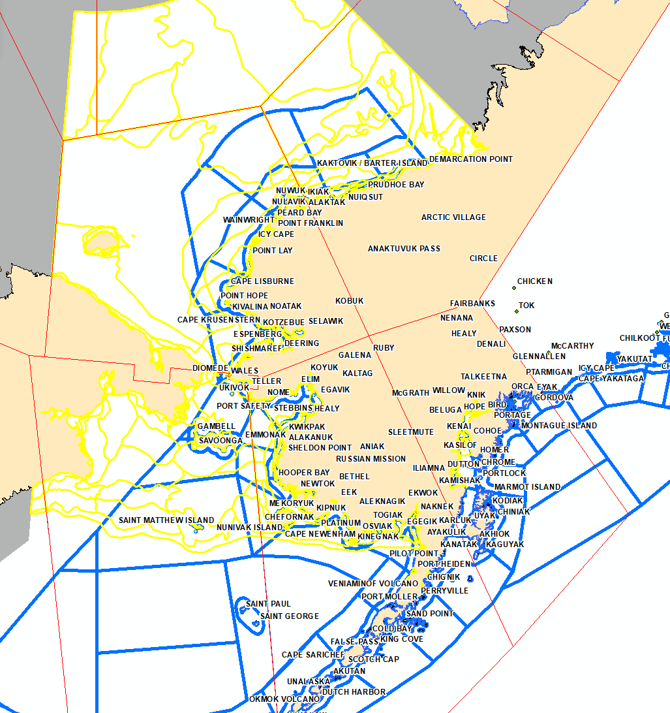
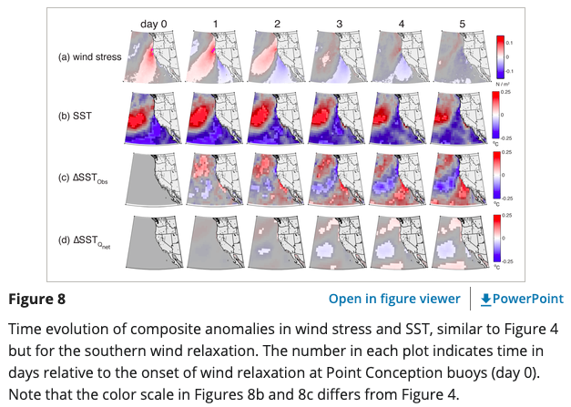
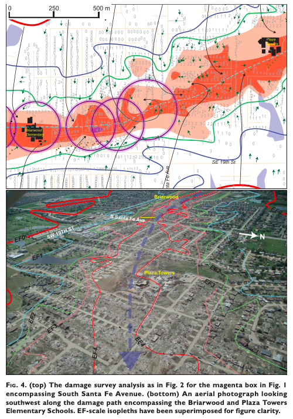
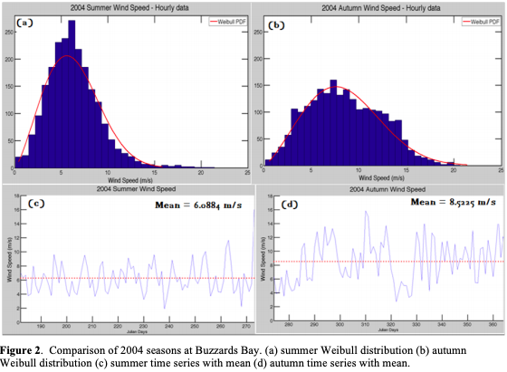

## Kayla Tinker (Flynn)

## Python: Script using arcpy for alaska sea ice program forecast verification using the integrated ice edge error (IIEE).
[Github Code](https://github.com/Tinker0425/IceEdgeVerification).
<embed src="2018_2022_IIEE.pdf" width="100%" height="500"/>.
   

## Python: ArcMAP Script to list zones in NWS ASIP Forecast Text Product

Due to the increase of the number of marine zones as of March 8, 2023, this helps the forecaster with the manual entry of zone names. The script answers the question "What are the names of the zones that have sea ice within them?" Find an example of the text product output with human input for the forecast verbage on the [NWS Alaska Sea Ice Program webpage](https://tgftp.nws.noaa.gov/data/raw/fz/fzak80.pafc.ice.afc.txt).   [Github Code](https://github.com/Tinker0425/ForecastTextFile).
 
   

## Wind Relaxation Events off the United States West Coast

In summertime along the U.S. West Coast, the winds exhibit a three‐stage cycle spanning ∼12 days. The prevailing upwelling‐favorable winds weaken (relax) or reverse off the Pacific Northwest, then reintensify, then weaken off central California. We study the sea‐surface temperature (SST) response to these “northern” and “southern” wind relaxations. [Oceans Paper 2016](https://agupubs.onlinelibrary.wiley.com/doi/full/10.1002/2016JC012613) 

   

## Damage Analysis of the 2013 Moore Oklahoma EF5 Tornado

Tree fall reveals highly convergent surface flow over the majority of the damage path. At times, the convergent flow is observed at radii less than that of the condensation funnel. A photogrammetric analysis of still photos and video show that the damaging winds extend well beyond the condensation funnel location. The condensation funnel often coincides with the EF1, EF2, and EF3 isopleths. A comparison is made between independent ground and aerial surveys that rated 4039 structures along the entire damage path. The aerial survey produces a low bias in EF0 and EF1 ratings. No apparent bias is observed in the EF2-4 categories. It is not possible to draw definitive conclusions concerning the small number of EF5 rated structures.
[BAMS Paper 2014](https://journals.ametsoc.org/view/journals/bams/95/10/bams-d-14-00033.1.xml) 

   

## Coastal Wind Analysis

Current analyses of surface wind speeds (SWS) for Buzzards Bay, Massachusetts and T. F. Green Airport, Rhode Island. The two-parameter Weibull
distribution is used to characterize the mean hourly wind data at the surface for Buzzards Bay. Seasonally at Buzzards Bay, it is shown that mean winds are stronger in the autumn months than in summer months. [Technical Report 2012](https://digitalcommons.uri.edu/cgi/viewcontent.cgi?article=1008&context=surfo_tech_reports)

   

[Full List of Publications on Google Scholar](https://scholar.google.com/citations?user=bCtPxisAAAAJ&hl=en&oi=ao)

